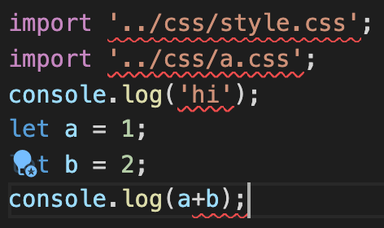
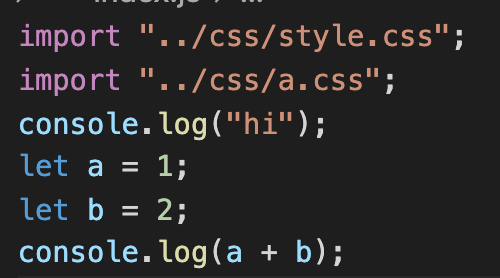

# Eslint, Prettier 개발 환경 세팅
프로그래머 분들은 각자의 코드 스타일, 작성법을 가지고 있다. 협업 관계에서 이런 부분이 통일화 되지 않는다면? 인수인계 시 이해하는 데에 어려움을 겪을 수 있고, 더 나아가 논쟁이 나타날 수 있다.   
### [EsLint](https://eslint.org/)   
자바스크립트의 스타일 가이드를 따르지 않거나 문법 적인 오류, 문제가 생길 수 있는 패턴(무한루프 등등)을 검출하여 올바르게 코드가 흘러가도록 도와주는 장치이다.   
### [Prettier](https://prettier.io/)   
Code Formatter로 프로그래머들의 코딩 스타일을 유지할 수 있도록 도와주는 툴이다. 가령, 자바스크립트는 세미콜론을 붙여도 되고, 안 붙여도 되는데 이를 한가지 경우로 고정시켜 준다거나, 큰따옴표, 작은따옴표를 통한 문자열을 한가지 경우로 고정시켜 주는 등의 헬퍼이다.   
프로젝트에 이들을 설정 해둔다면, 저장만으로 코드 포맷팅이 되도록 진행할 수 있다.dependency 설치 -> 설정을 진행해보자.   
## Dependency 설치하기
```
npm i -D eslint
npm i -D --save-exact prettier    //--save-exact는 현재 다운로드 받는 버전으로 package를 고정시킨다는 옵션
npm i -D eslint-config-prettier eslint-plugin-prettier
// eslint-config-prettier : eslint와 prettier가 충돌되는 부분을 비활성화 해주는 config
// eslint-plugin-prettier : Prettier의 규칙을 eslint에 적용시킬 수 있게끔 해주는 plugin
```
## Eslint 설정하기
모두 다운로드를 받았다면 `npx eslint --init`을 통해서 config파일을 만들자. 해당 명령어를 실행하면 여러가지 옵션을 선택할 수 있다. 가령 프레임워크가 뭔지(Vue or React ...) 어떤걸 원하는지 등등...   
나는 아래의 옵션대로 진행해보았다. 설정을 마치면 프로젝트 경로애 `.eslintrc.{format}`이 생길 것이다. 나는 json을 선택했기에 `.eslintrc.json`이 생겼다.
```
➜  project1 npx eslint --init
You can also run this command directly using 'npm init @eslint/config'.
Need to install the following packages:
  @eslint/create-config
Ok to proceed? (y) y
✔ How would you like to use ESLint? · problems
✔ What type of modules does your project use? · esm
✔ Which framework does your project use? · none
✔ Does your project use TypeScript? · No / Yes
✔ Where does your code run? · browser
✔ What format do you want your config file to be in? · JSON
Successfully created .eslintrc.json file in 'path'
```
설정 파일 내부를 아래와 같이 수정하자.
```
{
    "env": {
        "browser": true,
        "es2021": true
    },
    //extends : 어떤 eslint를 구동하며 어떤 플러그인을 쓸지
    "extends": ["eslint:recommended","plugin:prettier/recommended"],
    "parserOptions": {
        "ecmaVersion": "latest",
        "sourceType": "module"
    },
    //eslint rules
    "rules": {
        "prettier/prettier":"error"
    }
}
```
주목할 부분은 extends와 rules 부분이다. extends의 경우 어떤 eslint 옵션을 사용할지, 어떤 플러그인을 사용할지 설정하는 부분이다. npm을 살펴보면 eslint-airbnb 등등 여러 회사의 eslint 옵션이 나타나는데, `eslint:recommended`에 수정해주면 되고, 플러그인을 사용하는 경우 `plugin:~~`을 사용해서 넣어주면 된다.   
rules의 경우 사용할 규칙을 나타내는 것이다. 세미콜론이 없는 경우 에러가 나타나게 하기 `"semi":"error"`등등이 있는데 prettier만 우선 에러로 나타나게 해보자.   
git처럼 ignore파일도 존재한다. **.eslintignore**란 이름으로 존재하는데 말 그대로 점검 대상이 아닌 것들을 넣으면 된다. 웹팩을 설정했다면, 번들 파일들의 경로라거나, node_modules가 대상이 될 것이다.   
## Prettier 설정하기
**Prettier**설정은 좀 더 간댠(?)하다. Prettier 홈페이지를 가보면 [Playground](https://prettier.io/playground/)가 있는데 여기서 원하는 설정에 대해 테스트를 해볼 수 있다. 우선 가장 처음 나타나는 것을 사용하기 위해 맨 하단 **Copy config JSON**버튼을 클릭해서 복사하자.   
Prettier의 설정 파일 이름은 `.prettierrc.json`이다. 파일을 만들어서 붙여넣기 진행! 물론 눈치 채겠지만 ignore파일 또한 존재하므로 `.prettierignore` 만드는 것 잊지 말자.   
### workspace 설정하기
사람들 마다 사용하는 IDE는 다를 것이다. 우선 나는 vscode를 사용하기 때문에 vscode에 맞춰 진행할 예정이다. 위에서 설명 했듯이 파일을 저장할 때 eslint가 실행되도록 해볼 예정이다. 맥은 커맨드 키, 윈도우은 컨트롤 키를 누르고 shift + p를 입력해보자.
```
command + shift + p   //mac
ctrl + shift + p      //window
```
입력하고 settings로 검색해보면 **Open Workspace Settings(JSON)**이라고 나타나는데 이를 클릭하자. 그럼 `settings.json` 파일이 나타날 것이다. 이 파일에 아래의 내용을 저장하자.
```
{
    "editor.formatOnSave":true,     //on save 시 prettier 발동
    "editor.codeActionsOnSave":{
        "source.fixAll.eslint":true //on save 시 eslint 발동
    }
}
```
### 테스트 해보기
자! 길고 기나긴 설정을 마무리 했다면 코드를 작성해보자! 아래처럼 작성하면 붉은 줄이 엄청나게 나타날 것이다!    d
   
여기서 저장을 하게 되면!?   
   