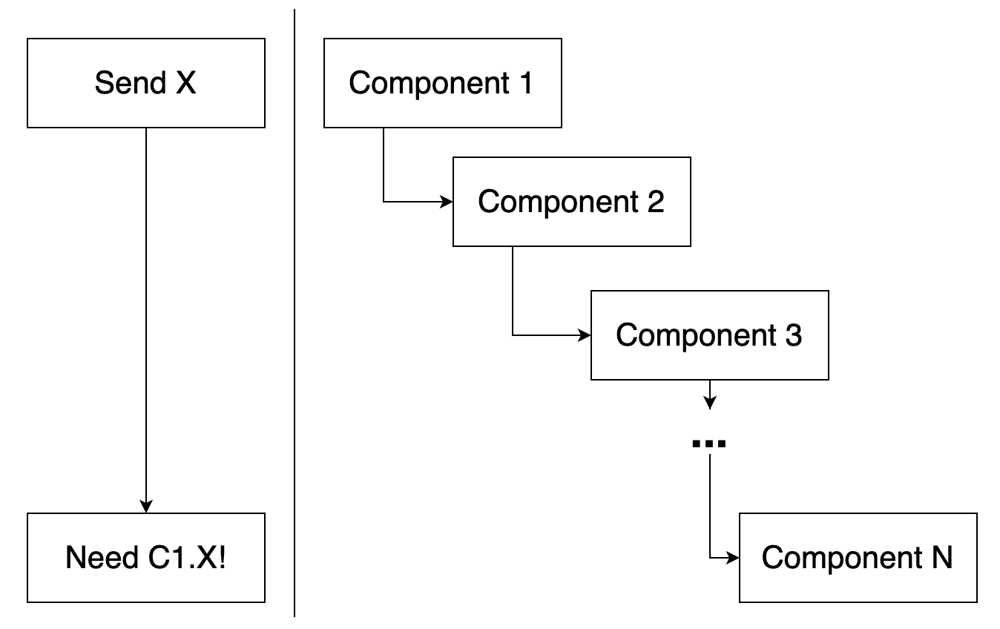
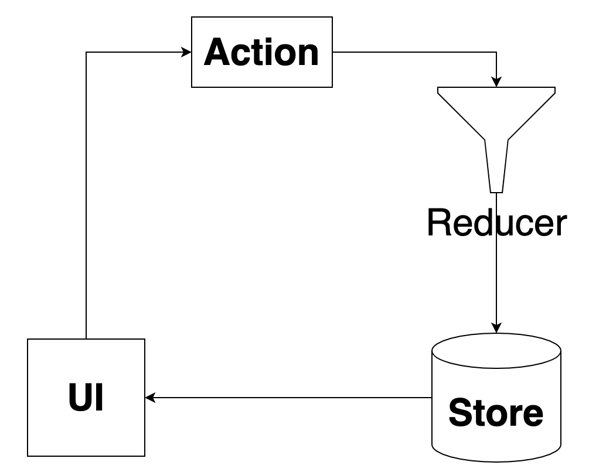

# Redux
[Redux](https://redux.js.org/)는 javascript의 상태관리를 위한 **라이브러리**이다. 아니 왜 상태관리가 필요할까?   
* 전역적으로 한 곳에서 중앙 관리하도록 하여 관리에 편의성을 준다.   
* **Props Drilling**을 해소한다.   


> Props Drilling이란? Property가 하위 컴포넌트를 따라 파고드는 것을 말하며, 가령 1~n번까지의 컴포넌트 상하관계에서 n번째에만 필요한 1번의 프로퍼티를 위해 2~n-1번째가 프로퍼티를 운반해야 하는 것을 말한다.   

## Redux의 특징
그렇다면 Redux는 어떤 특징을 가지고 상태관리를 하는지 확인해보자.
### 1) Single source is truth
한 곳의 공간에서 데이터(State)를 가져온다.
### 2) Store is read-only
데이터(State)는 읽기 전용이다. 오직 한가지 method(dispath method)를 통해서만 수정이 가능하다.
### 3) Changes are made with pure function
오직 순수 함수로만 데이터(state) 변경이 가능하다.
> pure function? 순수함수는 아래의 원칙을 가진다.   
(1) 동일 Input에 대해 동일 Output을 내보낸다.   
(2) Side-Effect를 만들지 않는다(외부에 영향이 없도록).

순수함수의 특징 2번에 대해서 더 설명이 필요하다. 나중에 나올 reducer method에도 필요한 설명이니까..! 아래 코드를 살펴보자.
```
function addBook(bookList,book){
    book.push(book);
    return book;
}
const books = [];
const newList = addBook(books,{name:'Load of The Rings'});
console.log(newList === books);  //true
```
함수 `addBook`은 변수로 받은 bookList에 새로운 book을 추가해 return한다. 새로운 객체로 할당 받았지만, books와 newList는 동일한 객체라는걸 알 수 있다. `addBook`의 경우 외부 객체에 변화를 주었기 때문에 pure function이 되지 못한다..! 이렇게 수정하면 pure function이 가능할 것이다.
```
function addBook(bookList,book){
    return [...bookList,book];
}
const books = [];
const newList = addBook(books,{name:'Load of The Rings'});
console.log(newList === books);  //false
```
이제 `addBook`은 외부 객체를 건들지 않고 새로운 객체를 만들어내며 pure function이 된다. 
## Redux Flow, JS Method

### Store
State가 저장되는 공간이다.   
javascript에선 redux 모듈의 `createStore`를 사용한다. 매개변수로는 Reducer 함수를 받게 된다.   
`const store = createStore(reducerFunc);`   
Store에서 값을 가져오는 것은 `getState`를 사용한다.   
`const state = store.getState();`
### Action
State를 수정하는 정의서이다. javascript Object로 이루어져있고, type key가 필수로 존재해야 한다.
```
{
    type: "ADD_USER",
    data: {name:"dino",age:"29"}
}
```
### Reducer
Action의 정의에 맞춰서 새로운 State를 **만들어낸다.** 리덕스 공식문서에도 나와있지만, 기존 state에 대해서 mutating을 하지 말라고 되어있다. 즉, reducer는 순수함수여야 한다는 것..! 언제나 새로운 객체의 state를 return해야 한다.   
javascript에서는 사용자 정의 함수이고, 첫 번쨰 인자로 state, 두번쨰 인자로 action을 받게 된다.
```
function reducerFunc(state=[],action){
    switch(action.type){
        case "ADD_USER":
            return [...state,action.data];
        ....
    }
}
```
중요한건 return이 무조건 있어야 한다는 것이다. `switch ~ case`를 사용하면 default를 꼭 정의해주자.
### Subscribe
State가 새로 생성이 될 떄 캐치할 수 있는 메소드도 존재한다. `subscribe`라는 메소드인데, 이를 통해 state가 새롭게 나타날 때마다 확인할 수 있다.
```
store.subscribe(()=>{
    console.log(store.getState());
});
```
이 [링크](https://github.com/deeeeno/vanilla-redux)는 VanillaJS에 Redux를 사용한 예제 코드이다. `src/js/index.js`를 보면 redux를 사용한 부분을 확인할 수 있다.