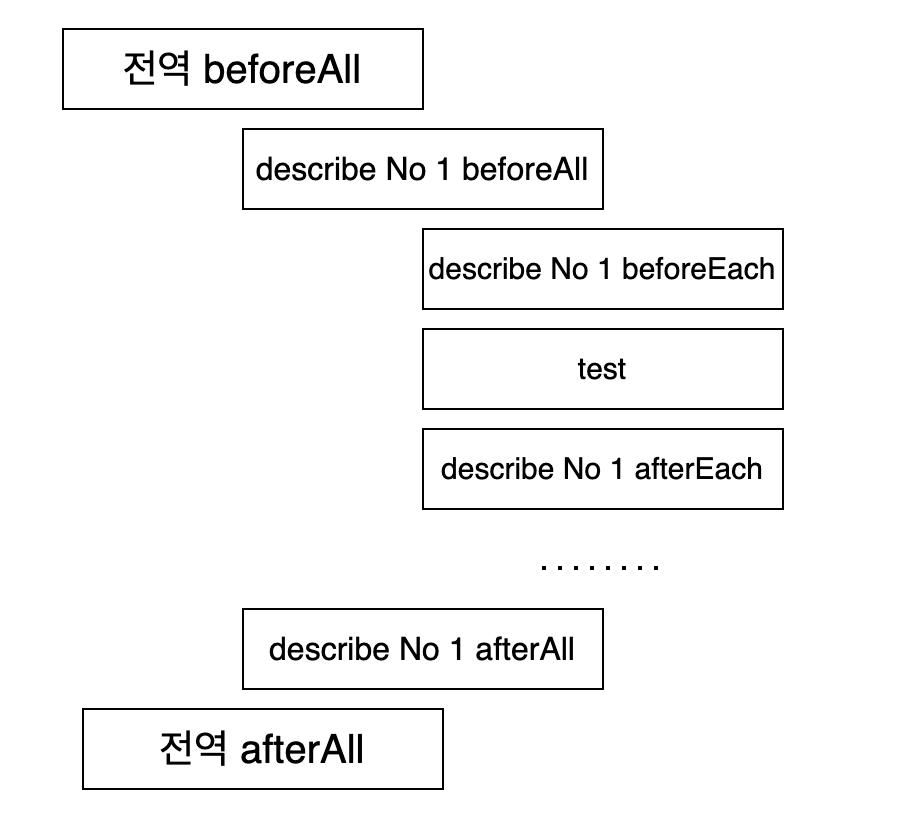

# jest 04 - 전,후 처리
## beforeEach,afterEach
처음은 각 test 전,후에 전/후처리 기능을 제공하는 **afterEach,beforeEach**를 알아보자. 각 테스트 케이스가 독립적이라는 가정 하에 아래 코드를 살펴보자.
```
//users.js
const users = [];
export default {
    find(id){
        const ret = users.find((user)=>user.id === id);
        return ret === undefined ? {} : ret
    },
    findAll(){
        return users;
    },
    create(...list){
        users.push(...list);
    },
    destroy(id){
        const idx = users.findIndex((user)=>user.id===id);
        users.splice(id,1);
    },
    destroyAll(){
        users.splice(0);
    },
    update(id,user){
        const idx = users.findIndex((user)=>user.id===id);
        users[idx] = user;
    }
}
```
```
//users.test.js
import userService from '../src/users';

test('userService findAll test',()=>{
    userService.create({id:1,name:'aino'},
    {id:2,name:'cino'},
    {id:3,name:'bino'},
    {id:4,name:'dino'});
    expect(userService.findAll().length).toEqual(4);
});

test('userService find test',()=>{
    const dino = userService.find(4);
    expect(dino.name).toEqual('dino');
});
```
두 가지 테스트 케이스에 대해서 어떻게 되어야 할까? userService findAll test의 경우 성공하고 userService find test는 실패해야 한다. 왜냐? 각 독립적인 테스트이니까 서로 영향이 없어야 하기 때문이지. 하지만 실상 실행해보면 아래와 같은 결과가 나타난다.
```
 PASS  test/user.test.js
  √ userService findAll test (3 ms)
  √ userService find test (26 ms)

Test Suites: 1 passed, 1 total
Tests:       2 passed, 2 total
Snapshots:   0 total
Time:        1.403 s, estimated 2 s
```
각 테스트케이스에 대해서 같은 조건이 되려면 후처리가 필요할 듯 하다. 지금 이 코드의 시작 조건은 users가 빈 배열로 시작되어야 하는 것이다. 이런 경우 **afterEach**함수를 통해 해결할 수 있다. 이름에서 알 수 있듯 각 테스트케이스가 끝난 후 실행되는 콜백 함수를 지정해주는 기능을 가지고 있다.
```
afterEach(()=>{
    console.log('테스트 종료 후 후처리~');
    userService.destroyAll();
});
```
그럼 우리가 원한 대로 테스트는 틀리고 아래처럼 로그가 남는걸 볼 수 있다.
```
console.log
    테스트 종료 후 후처리~
      at Object.<anonymous>.afterEach (test/user.test.js:4:13)
console.log
    테스트 종료 후 후처리~
      at Object.<anonymous>.afterEach (test/user.test.js:4:13)
```
테스트 두개가 정상적으로 통과되도록 아래처럼 코드를 수정했다고 하자. 
```
import userService from '../src/users';

afterEach(() => {
    console.log('테스트 종료 후 후처리~');
    userService.destroyAll();
});

test('userService findAll test',()=>{
    userService.create({id:1,name:'aino'},
    {id:2,name:'cino'},
    {id:3,name:'bino'},
    {id:4,name:'dino'});
    expect(userService.findAll().length).toEqual(4);
});

test('userService find test',()=>{
    userService.create({id:1,name:'aino'},
    {id:2,name:'cino'},
    {id:3,name:'bino'},
    {id:4,name:'dino'});
    const dino = userService.find(4);
    expect(dino.name).toEqual('dino');
});
```
두 개의 테스트를 보면  테스트용 유저 데이터를 주입하는 것 코드가 존재한다. 당연히 이런 초기 작업을 매 테스트케이스 전 실행시켜주는 기능도 존재한다. 이는 **beforEach**를 통해 진행할 수 있다. afterEach와는 사용법이 똑같다.
```
beforeEach(()=>{
    console.log('테스트 전 전처리~');
    userService.create({id:1,name:'aino'},
    {id:2,name:'cino'},
    {id:3,name:'bino'},
    {id:4,name:'dino'});
})
```
### beforeAll,afterAll
테스트케이스 사이에 처리함수를 실행해주는 기능이 있다면 당연히 모든 테스트 전/후의 처리를 추가해주는 기능 또한 존재한다. 이는 **beforeAll,afterAll**이다. 보통 DB 접근이 필요한 테스트를 할 때 DB 연결, 종료 등의 환경설정을 담당한다.   
이번 샘플 코드에선 시작 전,후로 모든 데이터를 초기화 시키도록 해보자.
```
beforeAll(()=>{
    console.log('테스트 전 모두 지우기');
    userService.destroyAll();
});
afterAll(()=>{
    console.log('테스트 후 모두 지우기');
    userService.destroyAll();
});
```

### describe
여러 테스트케이스들 안에 연관성이 있는 테스트들이 있다. 데모로 쓰고 있는 userService를 예로 들면 유저 삭제, 업데이트, 조회의 경우 기본이 되는 데이터가 필요로 하지만, 추가의 경우엔 사실상 필요가 없다. 혹은 더 나아가면 A그룹, B그룹의 테스트 등등 그룹화가 가능할 것이다. 이런 경우 함께 보아두면 훨씬 코드 읽기에도 수월하고 그들만의 환경을 구축하기에도 편할 것이다. **describe**메소드는 이를 가능하게 해준다. 여러 test들을 그룹화 해주고, 내부에 전,후처리 메소드인(before,after all,each)를 추가해 줌으로써 그들만의 환경을 만들 수 있다.
```
describe('유저가 1명 있는 경우 테스트',()=>{
    beforeEach(()=>{
        userService.create({id:1,name:'abc'});
    });
    afterEach(()=>{
        userService.destroyAll();
    });
    test('user Service create test',()=>{
        ...
    })
    ...
});
```
describe 내에서 전/후처리 메소드를 사용한 경우 주의해야할 점은 상위 describe(scope)의 전/후 처리 메소드까지 실행된다는 점이다. 아래의 [코드](demo/test/describe.test.js)를 살펴보자.
```
beforeAll(()=>console.log('전역 beforeAll'));
afterAll(()=>console.log('전역 afterAll'));
beforeEach(()=>console.log('전역 beforeEach'));
afterEach(()=>console.log('전역 afterEach'));

describe('describe No 1',()=>{
    beforeAll(()=>console.log('describe No 1 beforeAll'));
    afterAll(()=>console.log('describe No 1 afterAll'));
    beforeEach(()=>console.log('describe No 1 beforeEach'));
    afterEach(()=>console.log('describe No 1 afterEach'));

    test('test1 of describe No 1',()=>{
        console.log('test1 of describe No 1');
        expect(1).toEqual(1);
    });
    test('test1 of describe No 2',()=>{
        console.log('test1 of describe No 2');
        expect(1).toEqual(1);
    });
    test('test1 of describe No 3',()=>{
        console.log('test1 of describe No 3');
        expect(1).toEqual(1);
    });
})
```
코드를 보면 전역적으로 전/후처리 메소드들이 선언되어 있고, describe 1번에도 선언되어 있다. 이런 경우엔 아래의 순서로 실행이 된다.
